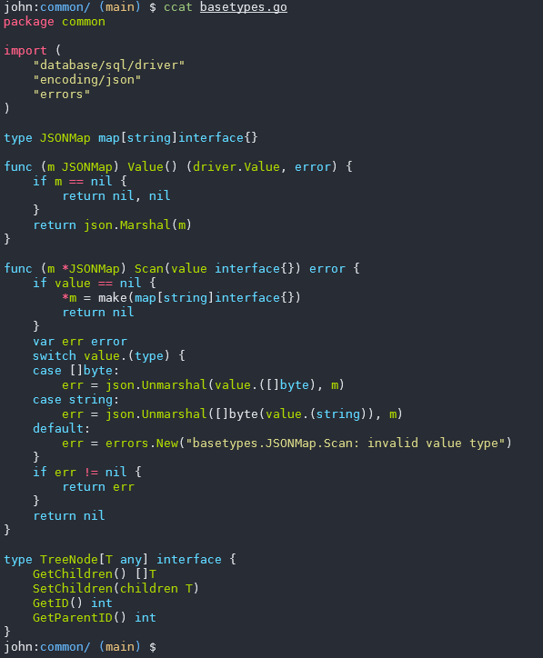
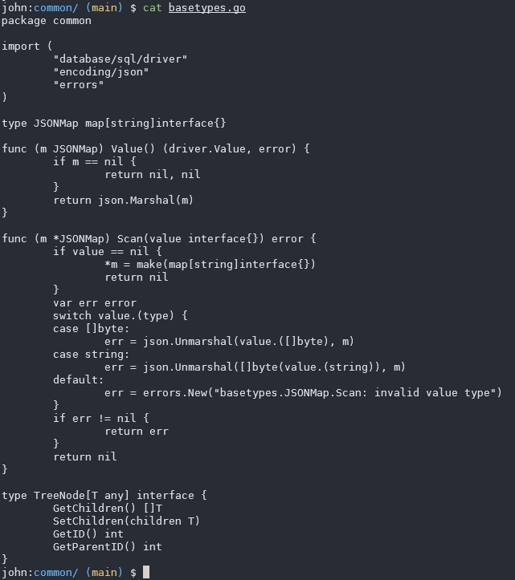

# 自带语法高亮的 cat – ccat

让 cat 源代码时如果带上语法高亮，会不会让工作效率更高一些呢？

把下面的代码放在 `.bashrc` 终端后面
```sh
function ccat() {
    local style="monokai"
    if [ $# -eq 0 ]; then
        pygmentize -P style=$style -P tabsize=4 -f terminal256 -g
    else
        for NAME in $@; do
            pygmentize -P style=$style -P tabsize=4 -f terminal256 -g "$NAME"
        done
    fi
}
```

然后安装依赖
```sh
sudo pip install pygments
```
安装完成后，重启终端让脚本生效。

让我们来看看执行的效果，这是新 cat 的效果



我们再对比下老的 cat 现实的效果

!


# References
https://skywind.me/blog/archives/3057
