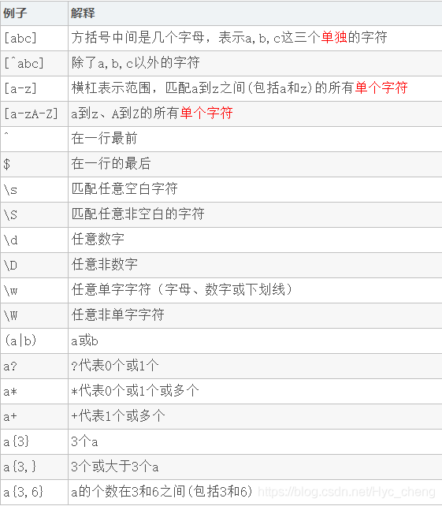

<!--
 * @Author: JohnJeep
 * @Date: 2020-10-30 09:38:07
 * @LastEditTime: 2024-01-06 14:22:33
 * @LastEditors: JohnJeep
 * @Description: shall 学习笔记
-->

# 1. Introduction

一旦启动了终端仿真软件包或者登录 Linux 虚拟控制台，你就会看到 shell CLI 提示符。提示符就是进入shell世界的大门，是你输入 shell 命令的地方。默认 bash shell 提示符是美元符号（ $），这个符号表明 shell 在等待用户输入。  

Shell 命令分为三大类：
- 内建命令(built-in)
- 外部命令
- 用户定义函数（function）、别名（alias）

查找某个命令属于哪类：`type -a <命令名称>`


# 2. Bash Terminal Shortcuts

Ctrl 开头的快捷键一般是针对字符的，而Alt开头的快捷键一般是针对词的。


## 2.1. Terminal

- `Ctrl + d` : 退出当前终端（end of file）
- `Ctrl + c` : 强制终止当前命令，终止的是前台进程
- `Ctrl + z` : 将当前任务暂停并挂在后台
- `Ctrl + s`: 冻结当前terminal的stdin，键盘输入的数据不会马上在terminal显示，而是恢复冻结后，在当前光标之前显示输入的数据。（Suspend）
- `Ctrl +  q`: 恢复当前terminal的stdin（Resume）
- ` stop + job号`: 将前台的进程挂起
- ` fg `: 将后台中的命令调至前台继续运行
  `fg %job number`: 将放在后台的任务通过指定其 `job number`，让它在前台工作。`%job number`是通过jobs命令查到的后台正在执行的命令的序号(不是pid，数字默认从 1 开始)
- `bg`: 进程转到后台
  `bg %number` 直接让在后台暂停（stopping）的任务变为运行（running）状态。
- `jobs`：查看放在后台的所有任务。
  - `+` : 代表最近被放到后台的任务号码。
  - `-` : 代表最近第二个被放到后台中的任务号码。从第三个任务开始，每个任务前面不在有 `+` 或者 `-` 符号存在。
- 终止后台进程
  - `kill + job号`
  - `kill + PID`
- nohup
  - 在用户注销或脱机后，任务还能继续在后天执行，与系统使用的 terminal 无关。
  - 一般的任务管理的后台与所使用的 terminal 有关，terminal 终止后，后台任务也就终止了。
  - 想要后台的任务在你注销用户后还能继续执行，可以使用 `nohup` 结合 `&`  搭配使用。


## 2.2. 大小写
- `esc + U` 或 `Alt + U`:  将当前光标之后以空格隔开的单词或者字符转换为大写，包括当前光标(upper)。
- `esc + L` 或 `Alt + L`:  将当前光标之后以空格隔开的单词或者字符转换为小写，包括当前光标(lower)。
- `esc + c` 或 `Alt + C`:  将当前光标之后以空格隔开的单词首字母转换为大写。


## 2.3. 光标移动
- `Alt + f` 前移动一个单词
- `Alt + b` 后移动一个单词
- `Esc +f` 移动到当前单词结尾
- `Esc + b` 移动到当前单词开头
- `Ctrl + b`: 光标向后(backward)移动，与 `←` 等价
- `Ctrl + f`: 光标向前移动(forward)，与 `→` 等价
- `Ctrl + a`：移动光标到命令行首。
- `Ctrl + e`：移动光标到命令行尾。


## 2.4. 删除
- `Ctrl + u`: 擦除当前光标之前的字符，不包括当前光标
- `Ctrl + k`: 擦除从当前光标之后到行尾的所有字符，包括当前光标
- `Ctrl + w`: 删除当前光标之前以空格隔开的任意长度的字符，不包括当前光标
- `Alt + d` : 擦除当前光标之后的一个单词，包括当前光标
- `Ctrl + h`: 删除当前光标前面的字符，每次删除一个字符
- `Ctrl + d`: 删除当前光标后面的字符，每次删除一个字符
- `Ctrl + /`: 撤销之前擦除的所有字符

> 擦除：输入的数据还在缓冲内存中，没有被删除，可以复制。


## 2.5. 粘贴
- `Ctrl + y`: 从当前光标处粘贴之前擦除的字符


## 2.6. 字符交换
- `Ctrl + t`: 当前光标处字符与前一个字符交换位置
- `Alt + t` : 当前光标处单词与前一个单词交换位置


## 2.7. 历史记录
- `Ctrl + r` 搜索历史记录
- `Ctrl + g` 退出当前搜索模式（在搜索历史记录下）
- `fc - l`   默认从最后往前显示 16 条历史记录。
- `Ctrl + p` 向上查找历史命令，与 `↑` 等价
- `Ctrl + n` 向下查找历史命令，与 `↓` 等价
- `Alt + r` : 取消当前所有改变的操作，若当前命令从历史记录中来，返回上一次历史记录的原始状态，若当前命令是手动输入，则会清空当前行


## 2.8. 其它命令
- `cd - ` 在两个相邻的目录之间进行切换。
- `&&` 仅在上一个命令成功的情况下，才能执行后面的多个命令
- `lsblk` 以树状的格式列出块设备


# 3. Shell 启动
当你登录 Linux 系统时，bash shell 会作为登录 shell 启动。登录 shell 会从 5 个不同的启动文件里读取命令：

- `/etc/profile`
- `$HOME/.bash_profile`
- `$HOME/.bashrc`
- `$HOME/.bash_login`
- `$HOME/.profile`

> `/etc/profile` 文件是系统上默认的 bash shell 的主启动文件，系统上的每个用户登录时都会执行这个启动文件。


# 4. 基本命令
- 解释采用哪种 shell 运行脚本: `!#/bin/sh`
- 多条语句之间使用 `;` 分割开
- 输入的命令采用 `()` 括起来，shell 会 fork 一个新的子 shell 进程执行括号里面的内容。
- 确定哪些命令是否属于 shell 内建命令：`type command`
  ```bash
  [root@DEV-ALWLPT-AP03 log]# type pwd
  pwd is a shell builtin
  ```
- 数据类型：只有字符串类型。


## 4.1. 引号
双引号优点
- 双引号里可以有变量。
  ```sh
  # 统计字符串的长度
  string="abcd"
  echo ${#string} # 输出 4
  ```
  
- 双引号里可以出现转义字符。
- 双引号内的特殊字符可以保持原有的特性，比如 `$`。
  ```sh
  # 使用 echo $var 得到 lang is en_US.UTF-8
  var="lang is $LANG"
  ```

单引号的限制
- 单引号里的任何字符都会原样输出，单引号字符串中的变量是无效的；
- 单引号字串中不能出现单引号（对单引号使用转义符后也不行）。
  ```sh
  # 使用 echo $var 得到 lang is $LANG
  var='lang is $LANG'
  
  其它示例：
    var=200      # =号两边不能有空格
    echo $var    # 200
    echo '$var'  # $var
    echo "$var"  # 200，打印变量var的内容
  ```


## 4.2. 变量
定义变量时，变量名称不加美元符号($)。
```sh
path="/etc/"  # 定义一个变量path
```

变量名前面加上 `$` 表示显示当前变量的值。
```bash
echo $path    # 调用变量
echo ${path} # 变量名外面的花括号是可选的，加不加都行，加花括号是为了帮助解释器识别变量的边界
```

```sh
[root@DEV-ALWLPT-AP03 log]# path="/etc/"
[root@DEV-ALWLPT-AP03 log]# echo $path
/etc/
[root@DEV-ALWLPT-AP03 log]# echo ${path}
/etc/
```

没有 `$`， shell 会将变量名解释成普通的文本字符串。
```sh
[root@DEV-ALWLPT-AP03 log]# echo date
date
```

变量可作为命令行的参数。
```sh
[root@DEV-ALWLPT-AP03 log]# path="/home"
[root@DEV-ALWLPT-AP03 log]# ls $path
data  emqx  emqx4  failed  go  
```

注意点：
- 变量名和等号之间不能有空格。
- 变量首个字符必须为字母(a-z，A-Z)。
- 变量中间不能有空格，可以使用下划线(_)。
- 变量不能使用标点符号。
- 变量不能使用 bash 里的关键字，可用 help 命令查看保留关键字。


### 4.2.1. 环境变量
Linux 的环境变量使用 `PATH` 表示，多个环境变量参数之间使用 `:` 分割开，而 Windows 下使用 `;` 分割开。打印 Linux 系统的环境变量 `echo $PATH`

- 本地变量: `VARNAME=value`。shell中默认的变量类型为字符串类型，定义时不需要指定类型。
- 环境变量: 将本地变量提升为环境变量，`export VARNAME=value`
- 删除已定义的环境变量或本地变量：`unset VARNAME`
- `env | grep VARNAME`: 查看系统中的环境变量 VARNAME


显示环境变量可用三种命令查看：env、set、printenv
- set 命令会显示出全局变量、局部变量以及用户定义变量，它还会按照字母顺序对结果进行排序。
  - `set -e` 命令：当脚本中某条命令报错以后立刻退出shell，不再执行后续代码。
  - `set -u` 命令：当使用到未定义的变量以后打印报错信息，然后退出程序。
- `env` 和 `printenv` 命令不会对变量排序，也不会输出局部变量和用户定义变量。printenv 可以显示个别的环境变量
  ```sh
  [root@KF-CFT-mongdb3 ~]# printenv HOME
  /root
  [root@KF-CFT-mongdb3 ~]# echo $HOME
  /root
  ```


### 4.2.2. 用户变量
除了环境变量， shell 脚本还允许在脚本中定义和使用自己的变量。定义变量允许临时存储数据并在整个脚本中使用，从而使 shell 脚本看起来更像一个真正的计算机程序。

用户变量可以是任何由字母、数字或下划线组成的文本字符串，长度不超过 20 个。用户变量区分大小写，所以变量 `Var1` 和变量 `var1` 是不同的。

- 一般自定义的变量名称使用大写来表示；使用 `$` 取出变量的值，使用`()` 取出命令的值。
- 引用一个变量值时需要使用美元符，而引用变量来对其进行赋值时则不要使用美元符。
  ```sh
  #!/bin/bash
  value1=10
  value2= $value1
  echo The resulting value is $value2
  ```


## 4.3. 命令替换
shell 脚本中最有用的特性之一就是可以从 shell 命令输出中提取信息，并将其赋给变量。把输出赋给变量之后，就可以随意在脚本中使用了。

有两种方法可以将命令输出赋给变量
1. 反引号字符 ` `` `
```sh
[root@CentOS7 ~]# var=`ls`
[root@CentOS7 ~]# echo $var
anaconda-ks.cfg a.txt authorized_keys Desktop Documents Downloads
```

2. `$()` 格式：`$(commmand)` 执行括号里面的命令功能。例如：`$(data)`
   ```sh
   [root@KF-CFT-mongdb3 ~]# test=$(date)
   [root@KF-CFT-mongdb3 ~]# echo $test   
   2021年 11月 08日 星期一 10:52:12 CST
   ```
   
   shell 先运行括号中的命令，然后将输出赋给变量 test。注意，赋值等号和命令替换字符之间没有空格。


## 4.4. 命令行参数
`$0`: 获取 shell 在命令行启动的脚本名，会包含完整的脚本路径。

去掉脚本的路径利用 `basename` 关键字实现。
```sh
# shell 文件 test.sh
#! /bin/bash
echo helloword
echo $0
echo $(basename $0) # 去掉路径名
echo $(basename -s .sh $0) # 去掉路径名和后缀

[root@DEV-ALWLPT-AP03 log]# ./test.sh
helloword
./test.sh
test.sh
test
```

- `$1`: 第一个参数 
- `$2`: 第二个参数 
- `$#`: 统计命令行参数的个数。
- `$*`: 将 shell 的所有参数当成单个参数。
- `$@`: 单独处理输入的每个参数。
- `$?`: 显示上一次命令的退出状态码。
  - 成功结束的命令退出状态码是 `0`。
  - 如果一个命令结束时有错误，退出状态就是一个正值；
  - 无效命令会返回一个退出状态码 `127`。
- `$$`: 显示脚本运行的当前进程 ID 号。
- `shift`: 允许你在不知道参数总数的情况下处理各种脚本参数，该命令会将下一个参数移动到 `$1`。默认情况下它会将每个参数变量向左移动一个位置，后面也可以指定移动多个参数的位置。如果某个参数被移出，它的值就被丢弃了，无法再恢复。


## 4.5. basename 
basename 是一个命令行中实用的小工具，可从给定的文件名中删除目录和后缀，并打印出来。

在 Centos7 系统中，已经默认安装了 `basename` 命令了，该命令包含在 `coreutils` 安装包里。
```bash
[root@DEV-ALWLPT-AP03 log]# rpm -qf /usr/bin/basename
coreutils-8.22-24.el7_9.2.x86_64
```

basename 命令默认删除所有结尾的 `/` 字符：
```bash
[root@DEV-ALWLPT-AP03 log]# basename /usr/local
local
```

默认情况下，每条输出行以换行符(\n)结尾。要以 `NUL` 结尾，请使用-z（--zero）选项。
```bash
[root@DEV-ALWLPT-AP03 log]# basename -z /usr/local
local[root@DEV-ALWLPT-AP03 log]#

```
删除文件名的扩展名
```sh
# 第一种
[root@DEV-ALWLPT-AP03 log]# basename -s .log IOT-Alert20230303_122511_663.log
IOT-Alert20230303_122511_663

# 第二种
[root@DEV-ALWLPT-AP03 log]# basename IOT-Alert20230303_122511_663.log .log
IOT-Alert20230303_122511_663
```


## 4.6. 执行数学运算
算术代换: 用于基本的算术计算。

- `echo $[11+12]` 两个数相加。
- `echo $[2#10+16#12]` 二进制的 10 加上十六进制的 12，结果按照十进制显示


# 5. 重定向
将脚本的输出重定向到 Linux 系统的不同位置。重定向可以用于输入，也可以用于输出，可以将文件重定向到命令输入。

输入重定向
- 大于符号 `>` 是输入重定向命令，将命令的输出发送到一个文件中。`ls > test.txt` 表示将 `ls` 命令列出当前目录下所有的文件放到test.txt 中，并`覆盖`原来 test.txt 文件中的内容。
- `>>` 是一个追加(append)命令，将命令输出的数据追加到文件中。
  - 用法：`命令 >> 文件名`。例如：`pwd >> text.tct` 将用`pwd`生成的数据放到 `test.txt` 文件中，`不会覆盖原`来的文件，新加的文件保留到文本后面。


输入重定向
- 输入重定向将文件的内容重定向到命令，使用小于符号 `<` 表示，简单的来讲，就是将原本需要由键盘输入的数据，改为由文件内容来替换。形式：`command < inputfile`  ，小于号说明数据正在从输入文件流向命令。
- <<  将文件中的内容追加到输入中。

临时重定向
- 想在脚本中生成错误信息时，使用输出重定向符来将输出信息重定向到 `STDERR` 文件描述符，这种方法会重定向每条设定的语句。`echo "This is an error message" >&2`

永久重定向
- 脚本中用 `exec` 命令告诉shell在脚本执行期间重定向某个特定文件描述符，可以重定向大量的数据。`exec 1>test`


三个标准文件描述符 
- `STDIN`: 标准输入 ，代码为 0，使用 > 或 >> 
- `STDOUT`: 标准输出 ，代码为 1，使用 < 或 <<
- `STDERR`: 标准错误，代码为 2，使用 2> 或 2>>


常见脚本重定向命令解释： `script.sh >/dev/null 2>&1`
```bash
script.sh >/dev/null 2>&1 是一种重定向输出和错误的常见方法。下面是对该命令的解释：

script.sh 是要执行的脚本或命令的名称。

> 表示重定向输出。/dev/null 是一个特殊的设备文件，通常被称为黑洞。将输出重定向到 /dev/null 意味着将输出丢弃，不会在终端上显示或存储。

2> 表示重定向错误。2 是标准错误输出的文件描述符。类似地，将错误输出重定向到 /dev/null 表示将错误信息丢弃。

&1 表示将输出重定向到与标准输出相同的位置。在这种情况下，&1 指的是标准输出的文件描述符。

因此，>/dev/null 2>&1 的整个命令行意味着将脚本或命令的输出和错误信息都重定向到 /dev/null，即将它们丢弃，而不在终端上显示或存储。
```

# 6. 结构化命令
许多程序要求对 shell 脚本中的命令施加一些逻辑流程控制。有一类命令会根据条件使脚本跳过某些命令。这样的命令通常称为结构化命令（ structured command）。


## 6.1. if 语句

如果你在用其他编程语言的 `if-then` 语句，这种形式可能会让你有点困惑。在其他编程语言中，if 语句之后的对象是一个等式，这个等式的求值结果为 TRUE 或 FALSE。但 bash shell 的 if 语句并不是这么做的。

bash shell 的 if 语句会运行 if 后面的那个命令。如果该命令的退出状态码是 0（该命令成功运行），位于 then 部分的命令就会被执行。如果该命令的退出状态码是其他值，部分的命令就不会被执行，bash shell 会继续执行脚本中的下一个命令或者执行 `else` 部分的内容。fi 语句用来表示 `if-then` 语句到此结束。

if 语句格式
```bash
if command
then
  commands
fi

# 另外一种形式
if command; then
  commands
else
  commands
fi

# 嵌套if
if command1
then
  commands
elif command2
then
  more commands
fi
```

```bash
echo "Is it morning? Please answer yes or no."
read YES_OR_NO
if [ "$YES_OR_NO" = "yes" ]; then          # 取值必须使用 ""
    echo "Good moning!"
elif [ "$YES_OR_NO" = "no" ]; then         # 嵌套 if
    echo "Good afternoon!"
else
    echo "Sorry, $YES_OR_NO not recognized. Enter yes or no."
fi
```


### 6.1.1. 高级特性
bash shell 提供了两项可在 `if-then` 语句中使用的高级特性：

* 用于数学表达式的双括号
* 用于高级字符串处理功能的双方括号


双括号 `((expression))` 命令允许你在比较过程中使用高级数学表达式。双括号命令中可以使用的符号：
```bash
var++
var--
++var
--var
!     # 逻辑求反
!     # 位求反
**    # 幂运算
<<    # 左位移
>>    # 右位移
&     # 位与
|     # 位或
&&    # 逻辑与
||    #逻辑或

val1=10
if (( $val1 ** 2 > 90 ))
then
  (( val2 = $val1 ** 2 ))
  echo "The square of $val1 is $val2"
fi
```


双方括号命令提供了针对字符串比较的高级特性。双方括号命令的格式如下：
`[[ expression ]]`


## 6.2. case 语句
- case 可以匹配字符串额通配符，每条分支语句必须以 `;;` 结尾。
- `esac` 表示整个 case 语句块的结束
  ```bash
  #! /bin/bash
  echo "Please input yes or no?"
  read TMP     # 从内尺中读输入的变量
  case "$TMP" in
    Yes|y|Y|YES)
        echo "It's ok.";;
    [nN]?)
        echo "It's not ok.";;
     *)
         echo "Input error.";;   # 默认执行
  esac
  return 0;
  echo "exec return."   # 该条命令不执行
  ```


## 6.3. for 语句
利用 `ls` 命令判断当前目录下文件的的类型
```bash
#! /bin/bash
for name in $(ls); do
  printf "$name "
  if [ -d "$name" ]; then
    echo "It's a dir."
  elif [-f "$name" ]; then
    echo "It's a file."
  else
    echo "others."
  fi
done
```


## 6.4. while 语句
```bash
while [ ... ]
do 
  .....
done 
```


## 6.5. test 条件测试
test命令提供了在if-then语句中测试不同条件的途径。如果test命令中列出的条件成立，test命令就会退出并返回退出状态码0。
这样if-then语句就与其他编程语言中的if-then语句以类似的方式工作了。如果条件不成立， test命令就会退出并返回非零的退出状态码，这使得if-then语句不会再被执行。

- `[ -p pipe ]` :左右括号分别表示一个命令，与参数之间需要使用空格隔开，并不是普通的括号。


### 6.5.1. 数值比较
- `-eq`: 等于
- `-ge`: 大于等于
- `-le`: 小于等于
- `-ne`: 不等于
- `-gt`: 大于
- `-lt`: 小于
- 不能在test命令中使用浮点值，bash shell只能处理整数。


### 6.5.2. 字符串比较
- 两个字符串之间可以使用 `>`、`<`、`=`、`!=` 来比较是否相同。
- `-n str1`: 检查 str1 的长度是否非 0
  ```bash
  # 判断val1变量是否长度非0，而它的长度正好非0，所以then部分被执行了。
  if [ -n $val1 ]
  ```
- `-z str1`: 检查 str1 的长度是否为 0 
  ```bash
  # 判断val2变量是否长度为0，而它正好长度为0，所以then部分被执行了。
  if [ -z $var2 ]
  ```


### 6.5.3. 文件比较
- `-d file`: 检查file是否存在并是一个目录
- `-e file`: 检查file是否存在
- `-f file`: 检查file是否存在并是一个文件
- `-r file`: 检查file是否存在并可读
- `-s file`: 检查file是否存在并非空
- `-w file`: 检查file是否存在并可写
- `-x file`: 检查file是否存在并可执行
- `-O file`: 检查file是否存在并属当前用户所有
- `-G file`: 检查file是否存在并且默认组与当前用户相同
- `file1 -nt file2`: 检查file1是否比file2新
- `file1 -ot file2`: 检查file1是否比file2旧 


### 6.5.4. 逻辑比较
- `expr1 -a expr2`: 逻辑与
- `expr1 -o expr2`: 逻辑或
- `expr1 ! expr2` : 逻辑非 


# 7. 函数

shell函数体中没有函数参数和返回值，函数参数在运行时传递。

格式
```bash
// 第一种格式 name为函数名
name()
{
  ...
}

// 第二种方式: 采用function关键字，name为函数名，后面没有小括号
function name
{

}
```

返回值
- 默认情况下，函数的退出状态码是函数中最后一条命令返回的退出状态码。在函数执行结束后（即执行完最后一条命令），可以用标准变量 `$?` 来确定函数的退出状态码。
- 语句执行成功，退出状态码为 `0`，没有执行成功退出状态码为 `1`；退出状态码的范围在 `0~255` 之间 
- 使用 `return` 命令来退出函数并返回特定的退出状态码。


# 8. 阻止命令输出
有时候，你可能不想显示脚本的输出。这在将脚本作为后台进程运行时很常见。如果在运行在后台的脚本出现错误消息， shell会通过电子邮件将它们发给进程的属主。这会很麻烦，尤其是当运行会生成很多烦琐的小错误的脚本时。

要解决这个问题，可以将 `STDERR` 重定向到一个叫作 null 文件的特殊文件。 `null` 文件跟它的名字很像，文件里什么都没有。 shell 输出到 `null` 文件的任何数据都不会保存，全部都被丢掉了。在 Linux 系统上 null 文件的标准位置是 `/dev/null`，你重定向到该位置的任何数据都会被丢掉，不会显示。
```sh
[root@KF-CFT-mongdb3 ~]# ls -al > /dev/null
[root@KF-CFT-mongdb3 ~]# cat /dev/null
[root@KF-CFT-mongdb3 ~]#
```

在输入重定向中将 `/dev/null` 作为输入文件。由于 `/dev/null`文件不含有任何内容，程序员通常用它来快速清除现有文件中的数据，而不用先删除文件再重新创建。
> 在输入重定向中将 `/dev/null` 作为输入文件。由于 `/dev/null` 文件不含有任何内容，程序员通常用它来快速清除现有文件中的数据，而不用先删除文件再重新创建。


# 9. shell调试
- `. test.sh -n`: 检查test.sh脚本中是否有语法错误，但不执行脚本。
- `. test.sh -x`: 跟踪执行的信息，将执行的每一条结果和命令都打印出来。
  > 注意：需要在脚本的头部中添加 `#! /bin/bash -x` ，跟踪的前后添加 `set -x` 和 `set +x`


# 10. 用户输入处理
`read` 命令
- 从标准输入（键盘）或另一个文件描述符中接受输入。在收到输入后， read 命令会将数据放进一个变量中。
- `-p` 参数：允许你直接在read命令行指定提示符。
- `-t`选项: 指定一个计时器，等待输入的秒数，在指定的时间内输入值。当计时器过期后， read命令会返回一个非零退出状态码。
- `-s` 参数：避免在read命令中输入的数据出现在显示器上，实际上，数据会被显示，只是read命令会将文本颜色设成跟背景色一样。常常用于用户密码的输入。 `read -s -p "Enter your password: " pass`


# 11. 正则表达式
两种流行的正则表达式引擎

- POSIX 基础正则表达式（ basic regular expression， BRE）引擎。例子：sed 编辑器。
- POSIX 扩展正则表达式（ extended regular expression， ERE）引擎。例子：gawk 工具。




## 11.1. 字符串限定符
- `.`: 匹配任意一个字符。
- `[]`: 匹配括号中的任意一个字符。
- `-(横线)`: 在 [] 括号内表示字符范围。eg: `[0-9]`。
- `_(下划线)` 匹配单个字符。
- `^`: 位于[] 括号的开头，匹配除括号中的字符之外的任意一个字符。
  示例: `[^abf]` 匹配除 abf 字符以外的所有字符。
- `\s`: 匹配任意空白字符。
- `\S`: 匹配任意非空白字符。
- `\d`: 匹配任意数字。
- `\D`: 匹配非任意数字。
- `w`: 匹配任意单字字符（字母、数字、下划线）。
- `W`: 匹配任意非单字字符。
- `[[:xxx:]]`: grep 工具转给你预定义的一些字符类。


## 11.2. 数量限定符
- `?`: 匹配前面的子表达式零次或一次，或指明一个非贪婪限定符。
- `+`: 匹配前面的子表达式一次或多次。
- `*`: 匹配前面的子表达式零次或多次。
- `{N}`: 精确匹配N次
- `{N,}`: 至少匹配N次
- `{,N}`: 最多匹配N次
- `{M,N}`: 至少匹配M次，最多匹配N次


## 11.3. 位置限定符
- `^xxx`: 匹配以xxx开始的行
- `$xxx`: 匹配以xxx结束的行
- `xxx\<`: 匹配以xxx字符开头的单词 
- `xxx\>`: 匹配以xxx字符结尾的单词
- `\b`: 匹配以xxx字符开始或结尾的单词
- `\B`: 匹配不包含以xxx字符开始或结尾的单词。eg: `\Bth\B----->mythed`


## 11.4. 其他特殊字符
- `\`: 转义字符，可以将普通字符转义为特殊字符，也可以将特殊字符转义为普通字符。
- `()`: 将正则表达式的一部分使用括号括起来，组成一个单元，对整个单元使用数量限定符。
- `|`: 连接两个子表达式。
- `%`: 匹配指定删除内容
  Shell 中使用百分号，将变量的内容从指定截取内容的后面删除（包括指定截取的内容），并从尾部开始删除。

  一个 `%` 号表示从尾部开始匹配删除，找到最近的内容停止；两个 `%%` 表示从尾部开始匹配删除，遇到最远的指定内容就停止匹配。

  ```sh
  [root@DEV-ALWLPT-AP03 log]# filename=aaabbccddaabbccdd
  [root@DEV-ALWLPT-AP03 log]# echo "${filename%bb*}"
  aaabbccddaa
  [root@DEV-ALWLPT-AP03 log]# echo "${filename%%bb*}"
  aaa
  ```


# 12. tee
- 作用：将从 `STDIN` 过来的数据同时发送到显示器和日志文件中。
- 默认情况下， tee 命令会在每次使用时覆盖输出文件内容。想将数据追加到文件中，必须用 `-a` 选项。


# 13. sed
sed俗称做流编辑器，以行单位进行字符处理。

- 格式
  - `sed 参数 '脚本语句' 带操作文件`
  - `sed 参数 -f '脚本文件' 带操作文件` 
- 脚本语句参数
  - `a(append)`：追加
  - `i(insert)`：插入
  - `d(delete)`：删除
  - `s(substitution)` : ` sed -i 's/echo/printf/g' for_tmp.sh` 将for_tmp.sh脚本文件中的所有echo替换为printf，使用 `-i` 参数并将修改的内容保存，而非仅仅输出显示到标准输出上。
- 选项参数
  - `-n`：默认情况下，脚本执行完后，自动打模式空间中的内容，使用 `-n` 可以屏蔽自动打印。
  - `-i`: 将修改后的源文件保存
  - `-E`：使用扩展正则表达式
  - `-e`: 使用多个脚本语句替换 时，需要用 `-e` 选项。


# 14. awk
以列单位进行字符处理，默认情况下按照TAB或空格对文件进行拆分。

- 格式
  - `awk 参数 '脚本语句' 带操作文件`。例子：`ps aux | awk '{print $3}'` 打印进程信息中的第三列
  - `awk 参数 -f '脚本文件' 带操作文件` 
- 变量
  - `print`: 打印输出变量，默认打印数据后自动会换行。
  - `printf`: 类似于C语言中的printf函数用法。  
  - 两个特殊的条件：BEGIN、END。例子：统计一个文件中的所有空格数 `awk '/^ *$/ {count=count+1} END {print count}' test.txt`
  - 常用内建变量
    - FILENAME：当前输入文件的文件名
    - NR：当前行的行号，R(record)
    - NF：当前行所拥有的的列数，F(field)
    - OFS：输出字段的列分隔符，默认是空格
    - FS：输入文件的列分隔符，默认是空格和TAB
    - ORS：输出字段的行分隔符，默认是换行符
    - RS：输入文件的行分隔符，默认是换行符
- 例子： 使用 awk 批量杀进程的命令：
    ```sh
    ps -ef | grep firefox | grep -v grep | awk '{print "kill -9 "$2}'|sh
    ```

    说明
    ```sh
    #列出了当前主机中运行的进程中包含firefox关键字的进程
    ps -ef | grep firefox | grep -v grep

    #列出了要kill掉这些进程的命令，并将之打印在了屏幕上 
    ps -ef | grep firefox | grep -v grep | awk '{print "kill -9 "$2}'

    #后面加上|sh后，则执行这些命令，进而杀掉了这些进程
    ps -ef | grep firefox | grep -v grep | awk '{print "kill -9 "$2}' | sh
    ```


# 15. expect

**Expect** 是[Unix](https://zh.wikipedia.org/wiki/Unix)系统中用来进行自动化控制和测试的软件工具，由[Don Libes](https://zh.wikipedia.org/w/index.php?title=Don_Libes&action=edit&redlink=1)制作，作为[Tcl](https://zh.wikipedia.org/wiki/Tcl)脚本语言的一个扩展，应用在交互式[软件](https://zh.wikipedia.org/wiki/软件)中如[telnet](https://zh.wikipedia.org/wiki/Telnet)，[ftp](https://zh.wikipedia.org/wiki/文件传输协议)，[Passwd](https://zh.wikipedia.org/wiki/Passwd)，[fsck](https://zh.wikipedia.org/wiki/Fsck)，[rlogin](https://zh.wikipedia.org/w/index.php?title=Rlogin&action=edit&redlink=1)，[tip](https://zh.wikipedia.org/w/index.php?title=Tip&action=edit&redlink=1)，[ssh](https://zh.wikipedia.org/wiki/Secure_Shell)等等。该工具利用Unix伪终端包装其子进程，允许任意程序通过终端接入进行自动化控制；也可利用[Tk](https://zh.wikipedia.org/wiki/Tk)工具，将交互程序包装在[X11](https://zh.wikipedia.org/wiki/X11)的[图形用户界面](https://zh.wikipedia.org/wiki/图形用户界面)中。

expect 参数项：
```bash
spawn               交互程序开始后面跟命令或者指定程序
expect              获取匹配信息匹配成功则执行expect后面的程序动作
send exp_send       用于发送指定的字符串信息
exp_continue        在expect中多次匹配就需要用到
send_user           用来打印输出 相当于shell中的echo
exit                退出expect脚本
eof                 expect执行结束 退出
set                 定义变量
puts                输出变量
set timeout         设置超时时间
```


# 16. References

- Bash快捷键大全: https://linux.cn/article-5660-1.html
- Terminator The robot future of terminals: https://gnometerminator.blogspot.com/p/introduction.html
- 如何在Qt中使用正则表达式: https://blog.csdn.net/Hyc_cheng/article/details/112132963#t5
- 十分钟学会 tmux: https://www.cnblogs.com/kaiye/p/6275207.html
