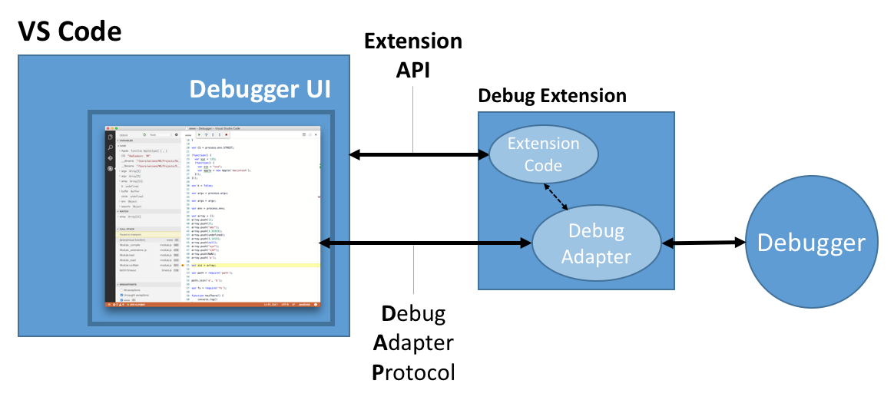
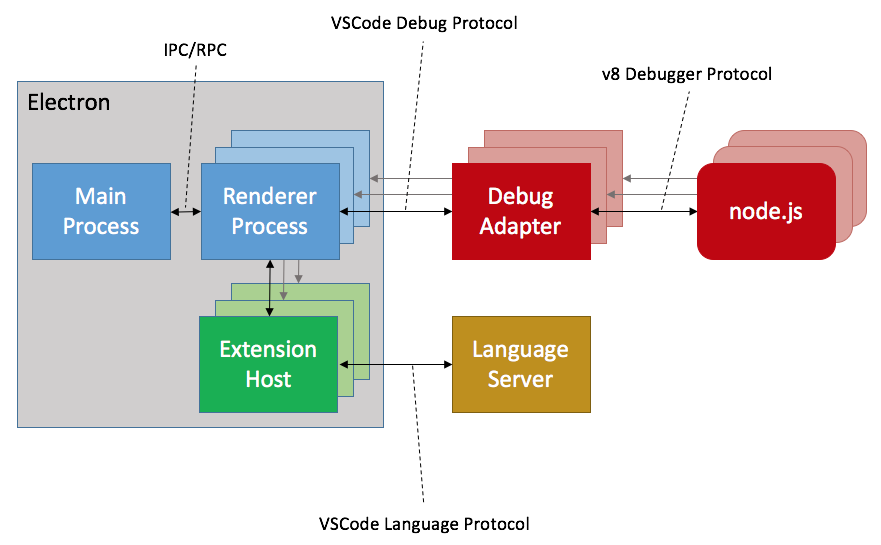

<!--
 * @Author: JohnJeep
 * @Date: 2019-09-11 13:46:17
 * @LastEditTime: 2021-12-18 01:25:37
 * @LastEditors: Please set LastEditors
 * @Description: VSCode 使用说明
 * -->

# 1. VSCode 快捷键

## 1.1. Folder

- `Ctrl + P` 快速打开文件
- `Ctrl+Shift+P` 或 `F1` 显示命令面板
- `Ctrl+Shift+N` 打开一个新的窗口
- `Ctrl+Shift+W` 关闭一个新的窗口
- `Ctrl+N`  新建一个文件
- `Ctrl+W` 关闭文件页面
- `Ctrl + Shift + T` 重新打开已关闭的页面

## 1.2. Terminal

- Ctrl +` 打开或关闭终端集成终端
- Ctrl Shift ` ：新建集成终端
- `Ctrl pageUp` ：切换到上一个终端
- `Ctrl pageDown` ：切换到下一个终端
- `Ctrl Shift 5`：拆分终端 


## 1.3. Edition

- `Ctrl + Alt +  ← / →` 将当前页面分栏到左边或者右边
- ` Ctrl + Shift + Home/End ` 删除光标右侧或左侧的所有内容
- ` Ctrl + Backspace ` 删除上一个单词
- ` Shift+Alt + ↓ / ↑ ` 向上或向下复制当前行
- ` Alt + ↓ / ↑ ` 向上或向下移动当前行
- `Ctrl+F2 ` 批量替换当前文件中所有匹配的文本
- ` Ctrl + Alt + ↓ / ↑ ` 向上或向下添加光标
- ` Alt + 数字 ` 直接跳到想要跳转的页面
- `Ctrl Shift o` 当前文件中搜索 symbols（匹配到相关的）
- `Ctrl T` 当前 workspace 中搜索 symbols
- `Ctrl + B` 打开或者关闭整个视图
- `Ctrl K Z` 切换禅模式(Toggle Zen Mode)，就可以把侧边栏、面板等全部隐藏。进入禅模式后，按 2次 Escape 键，退出禅模式。


## 1.4. Folding

- `Ctrl+K+0`  折叠所有代码
- `Ctrl+K+J`  展开所有代码
- `Ctrl+Shift+[`  折叠光标所处代码块内的代码
- `Ctrl+Shift+]`  展开光标所处代码块内的代码


## 1.5. Groups

- `Ctrl \` 拆分编辑器
- `Ctrl 数字` 在不同的编辑组之间进行切换
- `Shift + Alt + 0` 切换布局的方向（水平与垂直方向之间切换）


# 2. Config

为了和其他工具添加的配置文件区分开，VS Code 的配置文件都会放在一个子文件夹 `.vscode` 中。这个文件夹中可以包含以下几种文件。

- `settings.json`
配置文件写入的文件只有在 VS Code 中被打开时才会生效，相当于个性化设置。


- `tasks.json` (compiler build settings)

- `launch.json` (debugger settings)


- `c_cpp_properties.json` (compiler path and IntelliSense settings)

**[c_cpp_properties.json 官方文档](https://code.visualstudio.com/docs/cpp/c-cpp-properties-schema-reference)** 


官方 [variable-reference](https://code.visualstudio.com/docs/editor/variables-reference)
一些常见的变量名

```sh
${workspaceFolder} - VS Code当前打开工作区文件夹的路径
${file} - 当前打开文件的绝对路径
${fileBasename} - 当前打开文件的名称
${fileBasenameNoExtension} - 当前打开文件的名称，但是不加后缀名
${fileDirname} - 文件所在的文件夹路径
```


用户环境设置

- `editor.lineNumbers` 控制整个行号显示与否及如何显示
- `"editor.rulers": [120]` 设置垂直标尺为 120 个字符


# 3. 命令行面板（Panel）

使用 `Ctrl Shift P` 或 `F1` 打开命令行的面板，命令面板是根据输入框里的第一个字符来决定提供什么功能的，不同的字符执行的功能不一样。

- `>`：提供所有的命令。
- `@`：扫描当前文件，显示和跳转文件中的符号（Symbols），在 @ 符号后添加冒号：则可以把符号们按类别归类。
- `?`：获取帮助信息。
- `#`：显示和跳转工作区中的符号（Symbols）。
- `:`：跳转到当前文件中的某一行。

面板中直接输入字符执行命令。

- `process explorer`： 查看进程资源管理。


# 4. workspace

VS Code 则选择了一种相对轻量，而且大家都易于理解的方式，那就是所有的操作都基于文件和文件夹。当你打开一个文件夹，VS Code 的核心功能就会对这个文件夹进行分析，并提供对应的功能。

注意工作台最下方的状态栏，当 VS Code 没有打开任何文件夹的时候，它的颜色是紫色的。而如果在工作台中打开了某个文件夹，状态栏的颜色就会变成蓝色。


# 5. Debugging

VS Code 是把调试功能的最终实现交给插件来完成的。VS Code 提供了一套通用的图形界面和交互方式，比如怎么创建断点、如何添加条件断点、如何查看当前调试状态下参数的值，等等。无论你使用哪个编程语言或者调试器，这一套交互流程都是相似的。

VS Code 为插件作者提供了一套统一的接口，叫做 Debug Adapter Protocol（DAP）。当用户在界面上完成一系列调试相关的操作时，VS Code 则通过 DAP 唤起调试插件，由插件完成最终的操作。

下面这张 VS Code DAP 的流程图也很好地做出了解释：




插件架构

VS Code 主要用 Javascript 和 Node.js 来开发的。VS Code 是通过 Electron 实现跨平台的，而 Electron 则是基于 Chromium 和 Node.js，比如 VS Code 的界面，就是通过 Chromium 进行渲染的。同时， VS Code 是多进程架构，当 VS Code 第一次被启动时会创建一个主进程（main process），然后每个窗口，都会创建一个渲染进程（ Renderer Process）。与此同时，VS Code 会为每个窗口创建一个进程专门来执行插件，也就是 Extension Host。

除了这三个主要的进程以外，还有两种特殊的进程。第一种是调试进程，VS Code 为调试器专门创建了 Debug Adapter 进程，渲染进程会通过 VS Code Debug Protocol 跟 Debug Adapter 进程通讯。另一种则是 Language Server。

下面是 VS Code 的进程架构图



上图中，绿色的就是插件进程 Extension Host 了。VS Code 创建 Extension Host 进程的方式，就是创建一个新的 Electron 进程，并且以 Node.js 的形式运行。也就是说，这个进程就是一个完整的 Node.js 进程，Node.js 版本就是你使用的 Electron 中的 Node.js 。


# 6. Reference
- [微软官方 Visual Studio Code 文档](https://code.visualstudio.com)