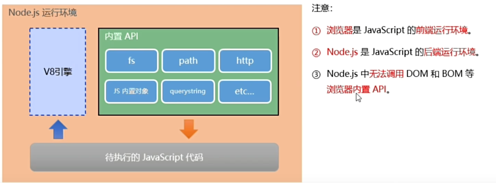

<!--
 * @Author: JohnJeep
 * @Date: 2021-03-19 23:38:31
 * @LastEditors: JohnJeep
 * @LastEditTime: 2025-03-30 23:58:04
 * @Description: nodejs learning
 * Copyright (c) 2025 by John Jeep, All Rights Reserved. 
-->

# Introduce

Nodejs 是一个基于 Chrome V8 引擎的 JavaScript 运行环境。

Nodejs 中的 JavaScript 运行环境

# How to study

1. JavaScript 基础语法
2. Node.js 内置 API 模块(fs, path, http)
3. 第三方库：express, mysql

# References

- Node.js official: http://nodejs.cn/learn/introduction-to-nodejs
- 英文文章从原理讲解Nodejs: https://www.sitepoint.com/asynchronous-programming-using-async-await-in-c

